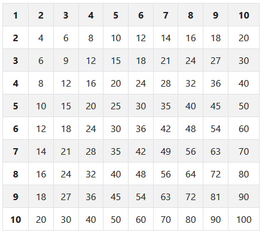

# Mini-TP 1 : Le tableau de multiplication

Le but des mini-TP est de mettre en pratique ce que vous avez acquis jusqu'à maintenant.

## Fonctionnement

A partir des chiffres de 1 à 10, le script doit remplir un tableau en 2 dimensions.

## TP

Je vous demande de me développer un programme permettant de remplir automatique un tableau HTML de 10 par 10.

Le résultat que vous devez obtenir :

----------

[Retour au sommaire](00_sommaire.md)