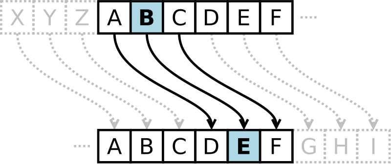

# Mini-TP 2 : Caesar Cipher (Le chiffre de César)

En cryptographie, le **chiffrement par décalage**, aussi connu comme **le chiffre de César** ou le **code de César**, est une méthode de chiffrement très simple utilisée par **Jules César** dans ses correspondances secrètes. 

## Fonctionnement

Le texte chiffré s'obtient en remplaçant chaque lettre du texte clair original par une lettre à distance fixe, toujours du même côté, dans l'ordre de l'alphabet.
Dans ses correspondances, César utilisait un décalage de 3 vers la droite, A est remplacé par D, B devient E, et ainsi de suite jusqu'à W qui devient Z. Pour les dernières lettres, on reprend au début. Donc X devient A, etc...

## TP

Je vous demande de me développer, grâce aux connaissances en PHP que vous avez emmagasinez jusque là, un programme permettant de chiffrer un mot.

Le mot a chiffré sera : `CONSTANTINOPLE`
Le résultat escompté est : `FRQVWDQWLQRSOH`

/!\ Attention : Il vous est interdit d'utiliser l'ASCII ! Il est possible de le faire sans !

**Bonne chance !**

----------

[Retour au sommaire](00_sommaire.md)
